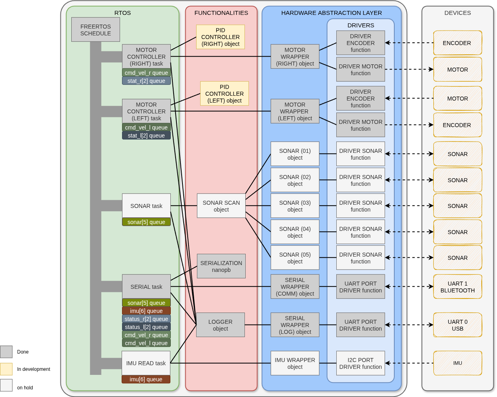

# littlebot_firmware
littlebot firmware's Source code *using TivaWare 2.2.0.295


## Littlebot firmware's achitecture 

<p align="center">

</p>

## A little commnication protocol
<p align="center">

</p>

## A little PID controller
<p align="center">

</p>

# LittleBot Firmware Documentation

This directory contains the generated documentation for the LittleBot firmware project.

## Generating Documentation

To generate the documentation, run:

```bash
make docs
```

The documentation will be generated in the `docs/html/` directory.

## Viewing Documentation

Open `docs/html/index.html` in your web browser to view the documentation.


## Requirements

- Doxygen (install with `sudo apt install doxygen` on Ubuntu)
- Graphviz (optional, for call graphs: `sudo apt install graphviz`)


